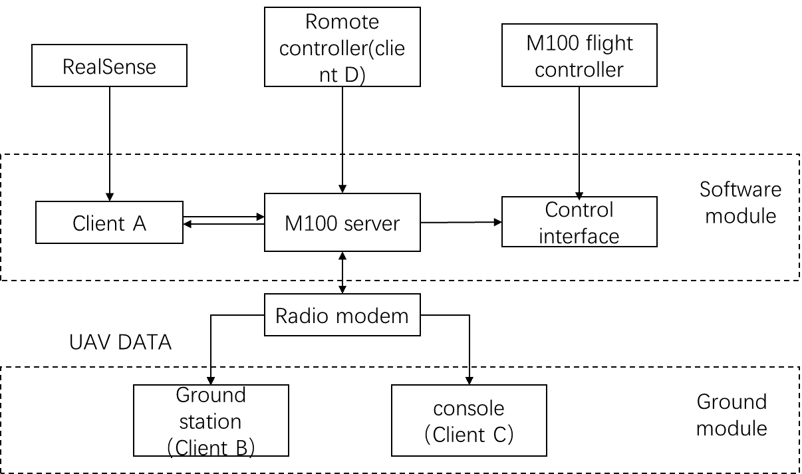
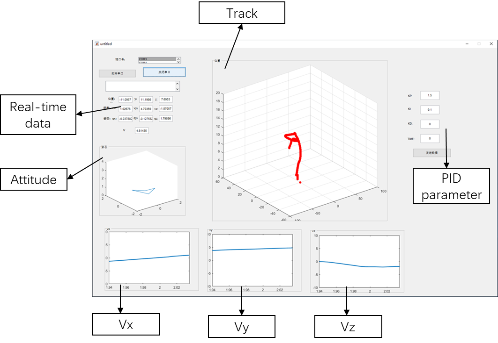
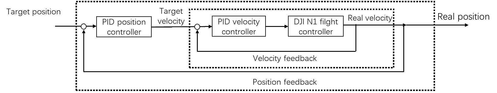
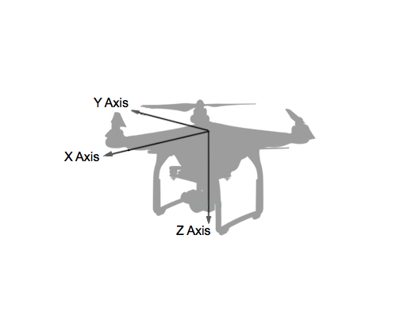
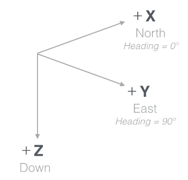

UAV-M100-PROJECT

​		我们将挑战1的软件程序分为飞行平台和抓捕机构两个部分。考虑到小球的尺寸太小，远距离识别较为困难，飞行平台把无人机而不是小球作为目标进行识别，靠近和跟踪。同时飞行平台要考虑躲避障碍物。抓捕机构把小球作为识别目标，独立于飞行平台运行。

飞行平台部分软件框架采用C-S模式如图1所示，服务器为各个客户端提供输入输出接口，保证数据正常传输。同时，在服务器中存在速度保护程序，保证飞机的最大速度不会超过预先设定的值；

​																						图2-1

 

​		客户端A负责采集Realsense的数据，由于realsense是红外双目相机，可以获得目标物体的深度。因此，客户端A将像素坐标转换为相机坐标系坐标。再根据相机在飞机中的位置，计算出目标物体在飞机坐标系下坐标。客户端A存在另一个线程，以100HZ的频率计算控制速度并发送给服务器。客户端B负责接受服务器发送的姿态、位置、速 度信息并以图形化的方式显示出来，同时，客户端B可以输入PID控制器参数，并发送给服务器修改控制器参数。客户端C为机载计算机的一个远程终端，保证我们可以正常使用机载计算机。客户端D为M100的遥控器，提供模式切换，保证在紧急情况下飞机可以切换为手动控制模式，防止飞机炸机。

为了检测无人机平台的飞行情况，收集并分析飞行数据，我们使用了matlab编写了一个地面站程序来实现对无人机飞行情况的监控。

​																							图2-2

为了使飞机的姿态角可控，我们使用串级PID。外环设计了基于视觉伺服的PID闭环控制，将物体相对于飞机坐标系的位置作为PID控制器的反馈输入，（0，0，0）作为目标输入，将控制器的输出作为目标速度，输入给下一级，控制频率为50hz。控制框图如图所示：        

 

 

内环为速度控制环，控制器输入目标速度，输出姿态角，控制频率为200hz。 

 

DJI 飞控中的速度控制接口只提供x为North方向，y为East方向，z为Down方向的NED坐标系下的速度控制，若直接使用该速度接口，需要根据飞机的偏航角，将飞机机身坐标系下的速度指令转换为世界坐标系。飞机坐标系示意图如图2-3

 

多线程分布式socket server在/m100_server中
